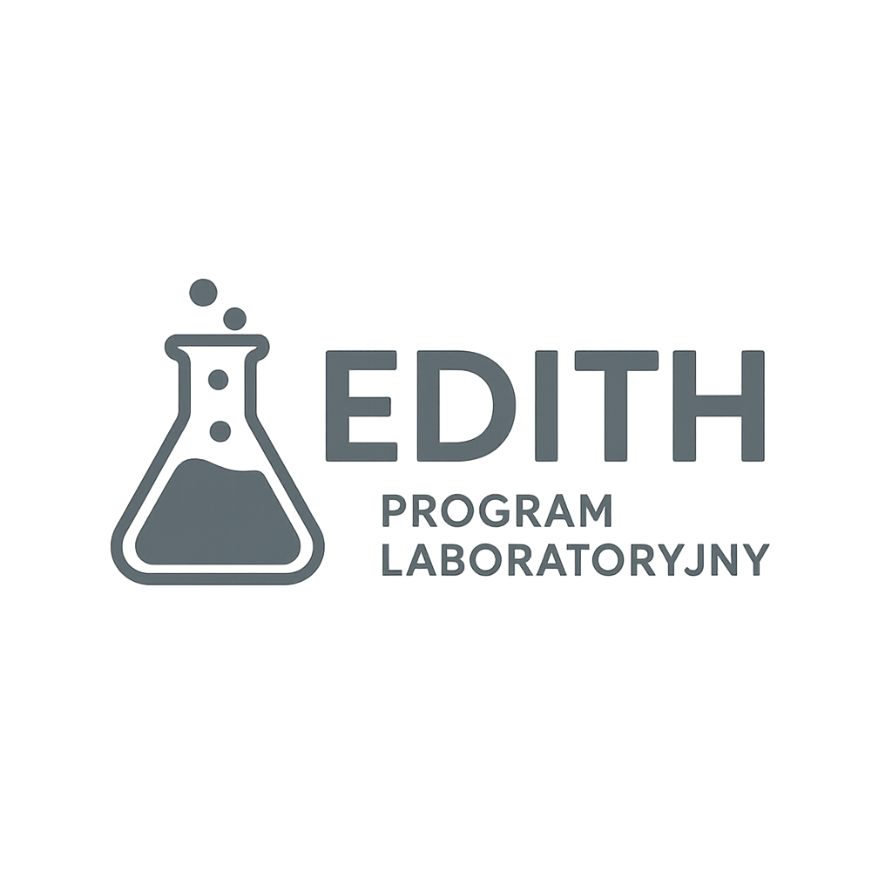

# 📋 Przewodnik Przeprowadzania Badań w Edith

**Kompletny przewodnik krok po kroku dla badaczy**

---

## 🎯 Cel Przewodnika

Ten przewodnik przeprowadzi Cię przez **kompletny proces badawczy** w platformie Edith - od planowania badania po analizę wyników i publikację raportów.

---

## 📚 Spis Treści

### 🚀 **Faza 1: Planowanie Badania**
- [**Krok 1:** Definiowanie Celów Badania](./01-defining-research-goals.md)
- [**Krok 2:** Wybór Metodologii](./02-choosing-methodology.md)
- [**Krok 3:** Planowanie Próby Badawczej](./03-sample-planning.md)

### 🛠️ **Faza 2: Przygotowanie Narzędzi**
- [**Krok 4:** Tworzenie Schematu Badawczego](./04-creating-research-schema.md)
- [**Krok 5:** Projektowanie Kwestionariusza](./05-designing-questionnaire.md)
- [**Krok 6:** Testowanie Pilotażowe](./06-pilot-testing.md)

### 📊 **Faza 3: Przeprowadzenie Badania**
- [**Krok 7:** Uruchomienie Badania](./07-launching-study.md)
- [**Krok 8:** Rekrutacja Uczestników](./08-participant-recruitment.md)
- [**Krok 9:** Monitorowanie Postępu](./09-monitoring-progress.md)

### 📈 **Faza 4: Analiza Danych**
- [**Krok 10:** Przygotowanie Danych](./10-data-preparation.md)
- [**Krok 11:** Analiza Statystyczna](./11-statistical-analysis.md)
- [**Krok 12:** Interpretacja Wyników](./12-interpreting-results.md)

### 📑 **Faza 5: Raportowanie**
- [**Krok 13:** Tworzenie Raportów](./13-creating-reports.md)
- [**Krok 14:** Wizualizacja Danych](./14-data-visualization.md)
- [**Krok 15:** Publikacja Wyników](./15-publishing-results.md)

---

## ⚡ **Szybki Start - 5 Minut**

Jeśli chcesz szybko rozpocząć pierwsze badanie:

1. **[Utwórz nowe badanie](./07-launching-study.md#quick-start)** - 2 minuty
2. **[Wybierz gotowy szablon](./04-creating-research-schema.md#templates)** - 1 minuta  
3. **[Uruchom test pilotażowy](./06-pilot-testing.md#quick-pilot)** - 2 minuty

---

## 🎓 **Poziomy Zaawansowania**

### 👶 **Początkujący**
- Używaj **gotowych szablonów** kwestionariuszy
- Skorzystaj z **przewodnika krok po kroku**
- Rozpocznij od **małych próbek** (10-50 uczestników)

### 🎯 **Średniozaawansowany**
- Twórz **własne schematy badawcze**
- Używaj **zaawansowanych typów pytań**
- Przeprowadzaj **analizę korelacji**

### 🔬 **Ekspert**
- Projektuj **złożone badania longitudinalne**
- Używaj **zaawansowanej analizy statystycznej**
- Twórz **niestandardowe raporty**

---

## 🛠️ **Narzędzia Edith**

### 📊 **Analityka w Czasie Rzeczywistym**
- Dashboard z live metrics
- Automatyczne obliczenia statystyczne
- Wykrywanie anomalii w danych

### 📈 **Zaawansowane Wizualizacje**
- Interaktywne wykresy
- Mapy cieplne odpowiedzi
- Analiza trendów czasowych

### 🤖 **Inteligentne Funkcje**
- Automatyczne tagowanie odpowiedzi
- Analiza sentymentu tekstów
- Predykcja completeness rate

---

## 📞 **Wsparcie**

### 🆘 **Pomoc Techniczna**
- [FAQ - Najczęściej Zadawane Pytania](./faq.md)
- [Rozwiązywanie Problemów](./troubleshooting.md)
- [Kontakt z Supportem](./support.md)

### 📚 **Zasoby Dodatkowe**
- [Przykłady Badań](./examples/)
- [Szablony Kwestionariuszy](./templates/)
- [Best Practices](./best-practices.md)

---

## 🏆 **Przykłady Sukcesów**

> *"Edith pomogła nam zebrać 2,000 odpowiedzi w ciągu 3 dni. Analiza automatyczna zaoszczędziła nam 2 tygodnie pracy!"*  
> **— Dr. Anna Kowalska, Uniwersytet Warszawski**

> *"Moduł analizy sentymentu odkrył trendy, których nie zauważyliśmy w tradycyjnej analizie."*  
> **— Zespół Badawczy, TechCorp**

---

## 🚀 **Gotowy na Start?**

Wybierz swój poziom i rozpocznij badanie:

| Poziom | Czas | Pierwszy Krok |
|--------|------|---------------|
| 👶 **Początkujący** | 15 min | [Definiowanie Celów →](./01-defining-research-goals.md) |
| 🎯 **Średniozaawansowany** | 30 min | [Tworzenie Schematu →](./04-creating-research-schema.md) |
| 🔬 **Ekspert** | 60 min | [Metodologia →](./02-choosing-methodology.md) |

---

**Powodzenia w Twoim badaniu! 🎉**

*Edith Research Platform - Making Research Smarter*

